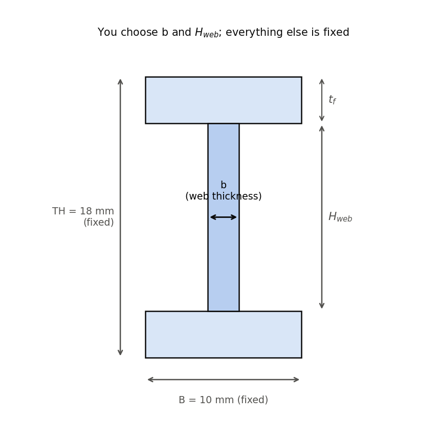
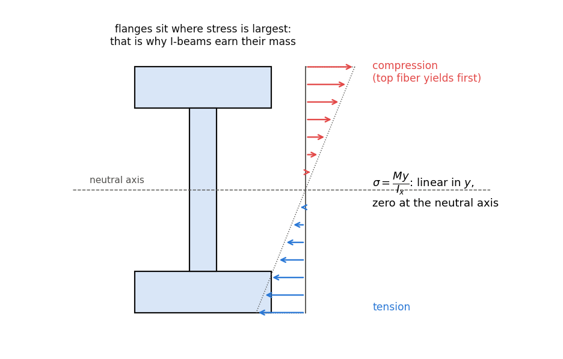
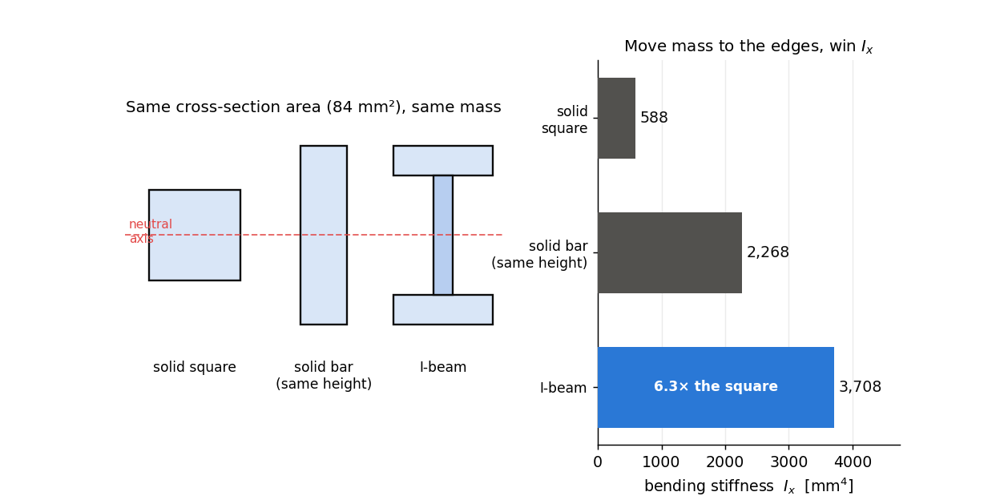
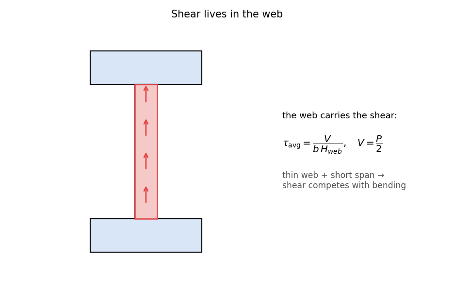
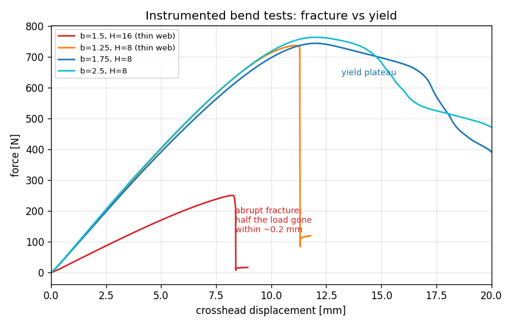
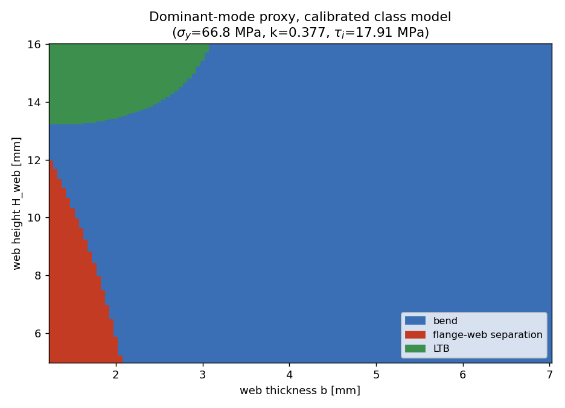
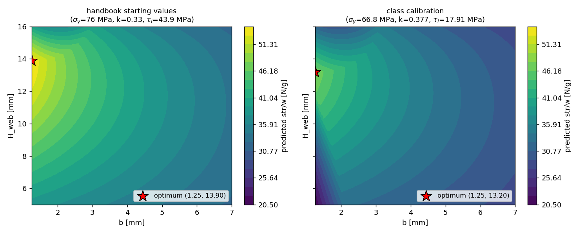

# Designing a Beam Under Messy Physics
### ME 323 Module 1, Lecture 1

Pick a 3D-printed I-beam that carries the most load per gram.

The equations give you a start. They will not give you the answer.

<!-- PLACEHOLDER (new campaign): hero photo of a printed I-beam on the three-point-bend fixture, load head touching the top flange. -->

---

## The challenge

- Fixed: total height 18 mm, flange width 10 mm, test span 150 mm, printed length 172 mm, PLA.
- You choose: **web thickness `b`** and **web height `H_web`** (which sets flange thickness).
- Goal: maximize **strength-to-weight**.
- Constraint you can't dodge: each print-and-test is slow and expensive, so you get very few.

---

## Why this is hard

Three things stand between you and a clean optimization:

1. Printed beams can **fracture along the layer lines**: the flange peels off the web at a printed interface whose strength appears in no handbook.
2. **Lateral-torsional buckling depends on the fixture**, not just the beam.
3. The **failure modes overlap**. Real beams fail in mixed, progressive ways.

We will price the layer-line mode with one calibrated number — but that number drifts with print session and support condition, and the other two problems remain. The equations narrow the problem. They do not solve it.

<!-- PLACEHOLDER (new campaign): side-by-side photos of three failed beams — one yielded and sagging, one with the web split along a layer line, one tipped sideways. Caption each with its (b, H_web). -->

---

## Three modeled capacity branches

- **Bending**: the beam yields in flexure.
- **Flange-web separation**: the shear flow at the printed junction exceeds the layer-line bond strength.
- **Lateral-torsional buckling (LTB)**: the beam tips over sideways.

The class capacity is the plain minimum of the three. The resulting dominant-mode label is a model proxy, not proof of what the broken beam will look like.

---

## Bending

$$P_\text{bend}=\frac{4\sigma_y I_x}{c\,L}, \qquad M_\text{max}=\frac{PL}{4}$$

---

## Why I-beams work

Bending strength is carried by $I_x$, and $I_x$ counts each bit of area by the **square of its distance** from the neutral axis:

$$I_x=\int y^2\,dA$$

- Material at the edges earns its mass; material near the center barely helps.
- So put the mass in **flanges** far out, top and bottom.
- The **web** does two cheap jobs: hold the flanges apart (set the lever arm) and carry the shear.

Maximize $I_x$ per gram: that is the strength-to-weight game this module plays.

---

## Same mass, more stiffness

Three sections of equal area. Relocating that same material to the flanges multiplies $I_x$: even against a solid bar of the same height, the I-beam wins because its mass sits at the extreme fibers.

---

## The catch

The I-beam logic says: thinner web, taller section, mass pushed outward.

Push too far and you wake the **other two modes**:

- a flange-web junction too thin to carry the shear flow — the printed layer-line bond lets go,
- a section too tall and narrow, which **tips over** (LTB) before it ever yields.

The efficient shape and the failure modes pull against each other. That tension is the design problem.

---

## Flange-web separation: shear flow at the printed junction

Every observed "shear-type" failure in the campaign is a flange peeling off the web — a fracture running *along* the printed flange-web interface. The stress that plane carries is the classic built-up-beam **shear flow** ($V=P/2$ in three-point bending):

$$\tau_j=\frac{V\,Q_f}{I_x\,t_w},\qquad Q_f=B\,t_f\,\frac{H_\text{web}+t_f}{2}\qquad\Rightarrow\qquad P_\text{sep}=2\,\tau_i\,\frac{I_x\,t_w}{Q_f}$$

The stress measure is textbook mechanics — the same glue-line check used for any built-up member.

---

## What the separation check assumes

The strength side is not textbook: $\tau_i$ is the bond strength **along the printed layer lines**, weaker than the bulk plastic, and no handbook lists it. Pre-lab 1 starts it at the bulk guess $\sigma_y/\sqrt3=43.9$ MPa and calibrates it from the test data — it lands near 18 MPa, and it drifts with print session and support condition.

The check predicts a capacity trend on one candidate plane. It is a dominant-mode proxy, not a fracture diagnosis — real beams still blur modes and fail progressively.

---

## Fracture vs yield, on the test machine

Same fixture, same material. The thin-web beams shed the load in one drop; the thicker webs plateau. No equation on the previous slides distinguishes these two endings.

---

## Lateral-torsional buckling: the idea

A tall, thin-flanged beam does not yield in place. It **rolls sideways and twists** at a load below its bending strength. A stability failure, not a strength one.

The elastic critical moment (Timoshenko elastic-stability theory, in the Eurocode `C_1`/`C_2` closed form):

$$M_{cr}=C_1\frac{\pi^2 E I_y}{L_b^2}\Big[\sqrt{R}-C_2 z_g\Big]$$

The next four slides open up every symbol in this equation, because this is the mode that decides your optimum and the one built on the most assumptions. You will not re-derive any of it: `P_LTB` arrives pre-coded in Pre-lab 1. The goal here is to read that code knowing what each symbol assumes.

<!-- PLACEHOLDER (new campaign): 3-second clip or photo sequence of a tall thin-web beam tipping sideways under load. The old campaign logged one on video ("LTB after yield"); re-shoot on the module fixture. -->

---

## The critical moment, term by term

$$R=\frac{C_w}{I_y}+\frac{L_b^2\,GJ}{\pi^2 E I_y}+(C_2 z_g)^2$$

The group under the root trades three effects against each other:

- $C_w/I_y$ — **warping rigidity**: resistance to the flanges bending in opposite directions.
- $L_b^2 GJ/(\pi^2 E I_y)$ — **St. Venant torsion**: the twisting stiffness of the open section.
- $(C_2 z_g)^2$ — **load height**: loading the top flange is destabilizing, so it subtracts.

$C_1=1.35$ (moment shape, central point load), $C_2=0.55$ (load-height factor).

---

## From critical moment to a load

The beam cannot exceed its yield moment, so LTB is capped at yield:

$$M_y=\frac{\sigma_y I_x}{c}\qquad P_\text{LTB}=\frac{4\,\min(M_y,\,M_{cr})}{L}$$

- take the **smaller** of the elastic buckling moment and the yield moment,
- convert moment to load with $M_\text{max}=PL/4$, so $P=4M/L$,
- with $L_b=kL$ and $z_g=c=TH/2$ (load at the top surface).

Below this line the beam tips; the min is a crude nod to inelastic buckling.

---

## What feeds it: the section constants

Three geometry terms from `section_props` in Pre-lab 1 carry the whole calc:

$$I_y=\frac{H_\text{web}\,b^3}{12}+2\cdot\frac{t_f\,B^3}{12}\qquad C_w=\frac{I_y\,(H_\text{web}+t_f)^2}{4}$$

$$J=\tfrac13\,\beta(b,H_\text{web})\,H_\text{web}\,b^3+\tfrac23\,\beta(t_f,B)\,B\,t_f^3,\qquad \beta(t,a)=1-0.63\tfrac{t}{a}+0.052\big(\tfrac{t}{a}\big)^5$$

- `I_y`: weak-axis stiffness — small for narrow flanges, which is why tall thin beams tip.
- `J`: St. Venant torsion, summed over web and flanges as thin rectangles.
- `C_w`: warping constant, the flanges' resistance to counter-bending.

---

## The assumptions underneath

The formula is exact only for an idealized beam. Ours is not quite that beam.

- **Thin-walled open section.** `J` and `C_w` use thin-rectangle theory. With webs up to 7 mm against a 10 mm flange, "thin" is generous; `J` starts to drift.
- **Timoshenko elastic stability.** `M_cr` is the classical torsional-flexural buckling load: linear-elastic, perfectly straight, no residual stress. A printed beam has all three imperfections.
- **Warping torsion.** Open sections warp under twist; the `C_w` term assumes the ends are free to warp. The real fixture restrains them somewhat, which is exactly what `k` absorbs.
- **Elastic, isotropic material.** $E=2.5$ GPa, $G=E/2.6$ (so $\nu=0.3$). Printed PLA is layered and anisotropic, not isotropic.

Each gap is a reason the equation narrows the answer without settling it.

---

## The one number that rules LTB: k

$$L_b=kL\qquad\Rightarrow\qquad M_{cr}\ \propto\ \frac{1}{(kL)^2}$$

- `k` is the **effective-length factor**: how far the beam can twist and bend sideways between whatever restrains it.
- It is set by the **fixture** — how the ends grip, whether they can warp, where the load lands — **not by the beam**.
- Textbook `k=1` is a simply-supported "fork" end free to warp; stiffer restraint drops `k` below 1.
- The handbook starting value is **`k=0.33`**. Calibration on the class subset gives **`k=0.377`**, which sets the equation design. It absorbs the real end restraint; it was never derived.

Because $M_{cr}\propto 1/k^2$, a small change in `k` swings the LTB load hard — and the calibrated equation optimum sits on a **bend–LTB knife edge** (the two capacities land within ~1% there), so it is the least trustworthy part of the map. **`k` does not transfer between fixtures — confirm it on ours before betting on that optimum.**

---

## Which mode drives?

For each beam, assign the dominant pure-mode proxy. Color a map of the design space by that label.

Tall thin webs tip (LTB, green). Short thin webs are separation-limited (red): the junction shear flow beats the layer-line bond. The middle bends (blue).

---

## Does the theory match the data?

Pre-lab 1 answers this with your beam dataset: you compute each beam's predicted capacity and mode, then put predictions against measurements on a parity plot.

Watch for two things:

- points **below the line**: beams that broke before the equations said they would,
- beams whose recorded failure looks nothing like the predicted mode.

<!-- PLACEHOLDER (new campaign): parity plot (predicted capacity vs measured strength, colored by predicted mode) built from the 44-beam dataset once strength_N lands. -->

---

## One assumption, two different beams

This illustration uses the handbook starting values ($k=0.33$, bulk $\tau_i$). The class calibration ($\sigma_y=66.8$ MPa, $k=0.377$, $\tau_i=17.9$ MPa) moves the exact equation optimum to $(b,H_\text{web})=(1.25,13.20)$.

---

## Where this leaves us

The equations are useful but partial:

- they cannot tell a yield plateau from a one-drop fracture,
- their LTB term rests on fixture assumptions,
- the modes blur,
- and we have only a few expensive tests.

A data-driven model that carries its own uncertainty is built for this situation. **Next lecture: Gaussian Processes and Bayesian optimization.**

---

## Before next time: Pre-lab 1

In `ME323_Module1_Prelab1_FailureModes`:

- load the beam data, compute strength-to-weight,
- code flexural yield and the junction shear-flow separation check (start $\tau_i$ at the bulk guess 43.9 MPa),
- compare dominant-mode proxies with measured strengths and failure notes, then calibrate $(\sigma_y, k, \tau_i)$,
- optimize strength-to-weight.

The design you find there becomes one of the class's two ground-truth queries later — the pre-lab explains how those queries work. Bring questions.
