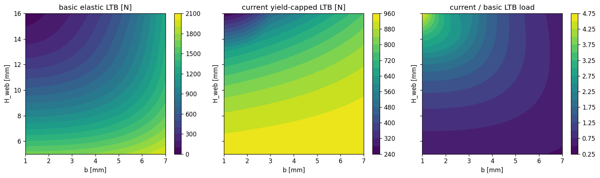
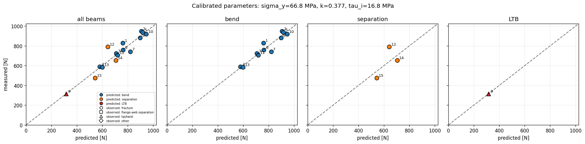
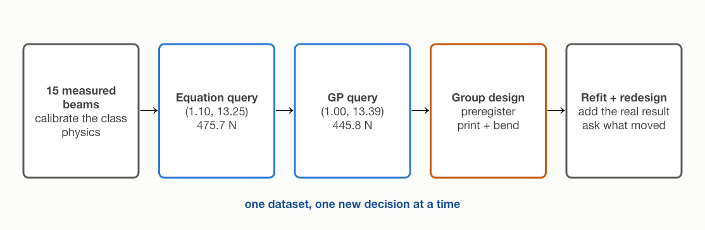

# Designing a Beam Under "Messy" Physics
### ME 323 Module 1, Lecture 1

Design a 3D-printed I-beam that carries the most load per gram.

Here, "messy" means uncertain properties, interacting failure modes, and test-to-test variation.

<!-- PLACEHOLDER (new campaign): hero photo of a printed I-beam on the three-point-bend fixture, load head touching the top flange. -->

---

## The challenge

- Fixed: total height 18 mm, flange width 10 mm, test span 150 mm, printed length 172 mm, PLA.
- You choose: **web thickness `b`** and **web height `H_web`** (which sets flange thickness).
- Goal: maximize **strength-to-weight**.
- Constraint you can't dodge: each print-and-test is slow and expensive, so you must make decisions with limited data.

---

## Why this is hard

Three things stand between you and a clean optimization:

1. Printed beams can **fracture along the layer lines**: the flange peels off the web at a printed interface whose strength appears in no handbook.
2. **Lateral-torsional buckling depends on the fixture**, not just the beam.
3. The **failure modes overlap**. Real beams fail in mixed, progressive ways.
4. **Material properties and measured strengths vary** from print to print and test to test.

<!-- PLACEHOLDER (new campaign): side-by-side photos of three failed beams — one yielded and sagging, one with the web split along a layer line, one tipped sideways. Caption each with its (b, H_web). -->

---

## Three modeled capacity branches

- **Bending**: the beam yields in flexure.
- **Flange-web separation**: shear at the printed junction exceeds the layer-line bond strength.
- **Lateral-torsional buckling (LTB)**: the beam tips over sideways.

The class model takes the minimum of these three capacities. Its governing-mode label is a prediction, not proof of the observed fracture mechanism.

**The model is incomplete:** modes can interact, other mechanisms may contribute, and tests vary.

---

## Bending

$$P_\text{bend}=\frac{4\sigma_y I_x}{c\,L}, \qquad M_\text{max}=\frac{PL}{4}$$

---

## Why I-beams work

Bending strength is carried by $I_x$, and $I_x$ counts each bit of area by the **square of its distance** from the neutral axis:

$$I_x=\int y^2\,dA$$

- Material at the edges earns its mass; material near the center barely helps.
- So put the mass in **flanges** far out, top and bottom.
- The **web** does two cheap jobs: hold the flanges apart (set the lever arm) and carry the shear.

Maximize $I_x$ per gram: that is the strength-to-weight game this module plays.

---

## Same mass, more stiffness

Three sections of equal area. Relocating that same material to the flanges multiplies $I_x$: even against a solid bar of the same height, the I-beam wins because its mass sits at the extreme fibers.

---

## The catch

The I-beam logic says: thinner web, taller section, mass pushed outward.

Push too far and you get the **other two modes**:

- a thin, short web can overload the printed flange-web junction,
- a tall, narrow section can **tip over** (LTB) before it yields.

The efficient shape and the failure modes pull against each other. The design problem is to balance that tradeoff while accounting for uncertain model parameters and test variability.

---

## One shear equation; choose the plane you want to check

$$\tau=\frac{VQ}{I_x t}$$

- $V$: internal shear force at the beam section. In either half of our three-point-bend span, $V=P/2$.
- $I_x$: second moment of area of the entire cross-section about the neutral axis.
- $Q$: first moment of the area above (or below) the horizontal plane being checked.
- $t$: width of material along that plane.

**Change the plane and $Q$ and $t$ change. The highest-stress plane need not be the weakest plane.**

---

## Q comes from area; t comes from the cut width

For the symmetric rectangular I-section, let $B$ be flange width, $t_f$ flange thickness, $H_\text{web}$ clear web height, and $b$ web thickness. For any horizontal plane,

$$Q=\int_{A'}y\,dA=\sum_i A_i\bar y_i,$$

where $A'$ is the area above the plane and $y$ is measured from the neutral axis. The denominator width $t$ is the local section width intersected by that plane.

**Flange-web junction:** $A'$ contains the top flange only, so

$$Q_j=(Bt_f)\left(\frac{H_\text{web}}{2}+\frac{t_f}{2}\right),
\qquad t_j=b.$$

**Neutral axis:** $A'$ contains the top flange plus the upper half of the web, so

$$Q_\text{NA}=Q_j+
\left(\frac{bH_\text{web}}{2}\right)\left(\frac{H_\text{web}}{4}\right)
=Q_j+\frac{bH_\text{web}^2}{8},
\qquad t_\text{NA}=b.$$

Thus both planes use the same local width for this geometry, but $Q$ changes because the area above the plane changes. For $(b,H_\text{web})=(2,12\text{ mm})$, $t_f=3$ mm, $Q_j=225$ mm$^3$, $Q_\text{NA}=261$ mm$^3$, and $\tau_j/\tau_\text{NA}=225/261=0.862$: the junction stress is 14% lower.

---

## What the separation check assumes

- **Stress model:** evaluate the beam-shear equation at the printed flange-web junction.
- **Strength model:** $\tau_i$ is the bond strength along the printed layer lines, not the bulk-plastic strength. No handbook gives this joint property.
- **Pre-lab calibration:** start from the bulk shear-yield estimate of 43.9 MPa, then infer $\tau_i$ from the beam tests. This campaign lands near 18 MPa; print session and support condition can move it.
- **Claim boundary:** this check predicts a capacity trend for one candidate plane. It does not diagnose a fracture mechanism from a force-displacement trace, and real failures can mix modes.

---

## Trace shape tells you when load was lost—not why

Thin webs can lose load abruptly; thicker webs can plateau or shed load gradually.

**Claim boundary:** the curve describes the timing and style of load loss. Mechanism requires specimen and fixture observations too.

---

## LTB starts from an elastic critical moment

$$
M_{\mathrm{cr}}
=
C_1\frac{\pi^2 E I_y}{L_b^2}
\left(\sqrt{R}-C_2z_g\right)
$$

- $M_{\mathrm{cr}}$ — elastic moment at which the idealized beam becomes laterally unstable.
- $E$ — Young's modulus; $I_y$ — weak-axis second moment of area.
- $L_b$ — effective unbraced length; $z_g$ — load height measured from the shear center.
- $C_1$ and $C_2$ — dimensionless coefficients for the moment diagram and load-height effect.

This predicts an elastic instability of an idealized beam; it is not an observed fracture label.

---

## Every term under the root is a squared length

$$
R
=
\frac{C_w}{I_y}
+
\frac{L_b^2GJ}{\pi^2EI_y}
+
\left(C_2z_g\right)^2
$$

- $C_w/I_y$ is a warping length scale; $C_w$ has units m$^6$ and $I_y$ has units m$^4$.
- The torsion term combines effective length, shear modulus $G$, and St. Venant torsional constant $J$.
- The load-height term represents top-flange loading; its contribution is subtracted after the square root.
- Dimensional check: $R$ is in m$^2$, the bracket in the critical-moment equation is in m, and $M_{\mathrm{cr}}$ is in N·m.

Course values: $E=2.50$ GPa, $G=0.962$ GPa, $C_1=1.35$, and $C_2=0.55$.

---

## The course converts moment to load—and caps at yield

$$
\begin{aligned}
M_y&=\frac{\sigma_y I_x}{c},
&
M_{\max}&=\frac{PL}{4},
&
L_b&=kL,
&
z_g&=c=\frac{T}{2},\\
P_{\mathrm{LTB\ branch}}
&=\frac{4}{L}\min\!\left(M_y,M_{\mathrm{cr}}\right).
\end{aligned}
$$

- $\sigma_y$ — effective flexural yield strength; $I_x$ — strong-axis second moment; $c$ — neutral axis to the outer surface.
- $P$ — center load; $L=150$ mm — support span. The moment relation assumes simply supported three-point bending.
- $k$ sets effective length. For top-surface loading, $z_g=c=T/2=9$ mm.

The minimum is a pragmatic yield cap used by the class model—not a full inelastic-buckling theory.

---

## Section geometry supplies $I_y$, $J$, and $C_w$

$$
\begin{aligned}
t_f&=\frac{T-H_w}{2},
&
I_y&=\frac{H_wb^3}{12}+2\frac{t_fB^3}{12},\\
J&=J_{\mathrm{rect}}(b,H_w)+2J_{\mathrm{rect}}(t_f,B),
&
C_w&=\frac{I_y(H_w+t_f)^2}{4},\\
J_{\mathrm{rect}}(x,y)&=\frac{1}{3}\beta as^3,
&
\beta&=1-0.63\frac{s}{a}+0.052\left(\frac{s}{a}\right)^5,\\
s&=\min(x,y),
&
a&=\max(x,y).
\end{aligned}
$$

- Geometry: $b$ and $H_w$ are design variables; flange width $B=10$ mm and total height $T=18$ mm are fixed.
- Properties: $I_y$ is weak-axis bending resistance, $J$ is St. Venant torsion, and $C_w$ is the warping constant.
- Units: the code converts every dimension from mm to m before returning $I_y$ and $J$ in m$^4$ and $C_w$ in m$^6$.

The rectangular $\beta$ correction is retained for finite aspect ratio; interpretation is yours, while derivation remains background.

---

## The LTB equation is conditional on five idealizations

- **Section geometry:** open, doubly symmetric, and thin-walled. The torsion approximation is least credible for the thickest webs.
- **Elastic stability:** linear material, initially straight beam, and no residual stress; printed parts violate all three.
- **Warping and supports:** end restraint is compressed into fitted $k$ rather than modeled from the fixture geometry.
- **Material:** isotropic $E$ and $G$. Printed PLA is layered and direction-dependent; the model uses $E=2.50$ GPa and $G=0.962$ GPa.
- **Loading:** central top-flange load represented by fixed $C_1$, $C_2$, and $z_g$.

**Consequence:** the LTB branch is a fixture-conditional capacity proxy with model uncertainty.

---

## $k$ changes effective length—and enters $M_{\mathrm{cr}}$ twice

$$
\begin{aligned}
L_b&=kL,\\
M_{\mathrm{cr}}(k)
&=
C_1\frac{\pi^2EI_y}{(kL)^2}
\left[
\sqrt{
\frac{C_w}{I_y}
+
\frac{(kL)^2GJ}{\pi^2EI_y}
+
(C_2z_g)^2
}
-C_2z_g
\right].
\end{aligned}
$$

- $k$ is a dimensionless effective-length factor for the fixture; lower $k$ means stronger restraint.
- Handbook starting value: $0.33$. Fifteen-beam class fit: $0.377$.
- This is **not a pure inverse-square law** because $kL$ also appears inside the square root.
- At the equation design, changing $k$ from 0.33 to 0.377 lowers elastic $M_{\mathrm{cr}}$ from 28.6 to 23.1 N·m; the yield moment is 23.3 N·m.

Because $k$ absorbs fixture behavior and omitted physics, it does not transfer automatically to another test setup.

---

## What you must understand about the LTB branch

- **Recognize the mode:** tall, thin sections can roll sideways and twist before flexural yield.
- **Read the design variables:** decreasing web thickness $b$ and increasing clear web height $H_w$ can make LTB more competitive.
- **Interpret $k$ physically:** it summarizes effective restraint and is fixture-specific.
- **Separate quantities:** $M_{\mathrm{cr}}$ is an elastic moment; the course LTB branch converts it to load and applies a yield cap.
- **Read margins:** a near-tie between branches makes the single governing label fragile.

**Background, not assigned:** deriving $I_y$, $J$, $C_w$, or the $C_1$/$C_2$ closed form.

---

## Model choices reshape the LTB branch

- **Axes:** $b$ is web thickness and $H_w$ is clear web height, both in mm.
- **Left:** stripped-down elastic LTB.
- **Center:** current yield-capped class branch.
- **Right:** current divided by basic.

The correction is design-dependent; it cannot be replaced by one constant scale factor.

---

## The parity plot is an in-sample diagnostic

- **How to read it:** $x$ is predicted load, $y$ is measured load, and the dashed line is equality.
- Color encodes the predicted branch; marker shape encodes the observed specimen or fixture note class.
- **Fitted parameters:** $\sigma_y=66.83$ MPa, $k=0.377$, and $\tau_i=16.76$ MPa.

**Claim ceiling:** the same 15 beams set the parameters and appear in the plot. This shows fitted capacity, not held-out generalization.

---

## Calibrate parameters first; then freeze them for design

$$
\begin{aligned}
\boldsymbol{\theta}
&=(\sigma_y,k,\tau_i),\\
P_{\mathrm{cap}}(b,H_w;\boldsymbol{\theta})
&=
\min\!\left[
P_{\mathrm{bend}}(\sigma_y),
P_{\mathrm{sep}}(\tau_i),
P_{\mathrm{LTB}}(\sigma_y,k)
\right],\\
\widehat{\boldsymbol{\theta}}
&=
\arg\min_{\boldsymbol{\theta}}
\frac{1}{15}\sum_{i=1}^{15}
\left[
\log P_{\mathrm{cap},i}(\boldsymbol{\theta})
-\log P_{\mathrm{meas},i}
\right]^2,\\
(b^\star,H_w^\star)
&=
\arg\max_{(b,H_w)}
\frac{P_{\mathrm{cap}}(b,H_w;\widehat{\boldsymbol{\theta}})}
{m_{\mathrm{est}}(b,H_w)}.
\end{aligned}
$$

- $\sigma_y$ controls bending and the yield cap, $k$ controls effective length, and $\tau_i$ controls interface separation.
- The 15-beam fit gives 66.83 MPa, 0.377, and 16.76 MPa. This same-data fit is not a held-out score.
- With those values frozen, the 0.05 mm grid search returns $b=1.10$ mm and $H_w=13.25$ mm at 48.7 N/g predicted strength-to-estimated-mass.

---

## The physics model is useful because its limits are explicit

- **It does provide** a capacity estimate and a dominant-branch proxy for each design.
- **It does not provide** a unique fracture diagnosis from a force–displacement trace.
- **Its calibration is conditional** on this fixture, print campaign, and 15-beam dataset.
- **Its labels are least stable** near intersections of capacity branches—the region an optimizer often favors.

**Next lecture:** model the remaining discrepancy and uncertainty with a Gaussian Process; do not erase the physics.

---

## The module adds evidence one decision at a time

- Fifteen measured beams calibrate the class physics model.
- The frozen equation query at $(b,H_w)=(1.10,13.25)$ returns 475.7 N.
- The frozen GP query at $(b,H_w)=(1.00,13.39)$ returns 445.8 N.
- Your group design is the new print-and-bend observation; the models are refit after that result.

Beams 16 and 17 are frozen model responses, not new physical tests.

---

## Pre-lab 1: turn equations into a testable model

Notebook: **ME323 Module 1 — Pre-lab 1, Failure Modes**

- reduce four force–displacement traces to strength, including the beam 9 fixture/twist event;
- code and unit-check the bending, printed-junction separation, and yield-capped LTB branches;
- treat 43.9 MPa as the starting bulk ceiling for $\tau_i$—not a measured interface strength;
- calibrate $\sigma_y$ (effective flexural strength), $k$ (fixture effective-length factor), and $\tau_i$ (printed-interface shear strength);
- compare predicted and measured loads while keeping predicted branches separate from observed notes;
- freeze the fitted parameters, then optimize predicted strength divided by estimated mass.

Bring one question about a variable, one about an assumption, and one about a mismatch.
