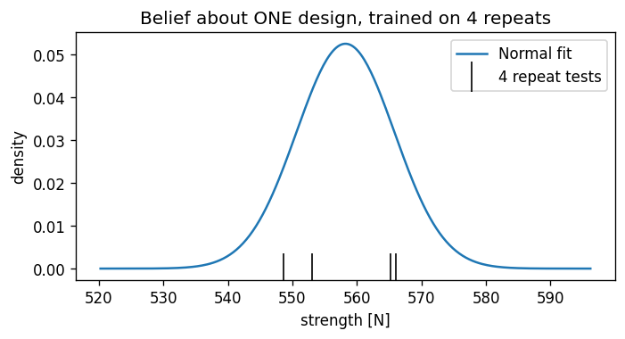
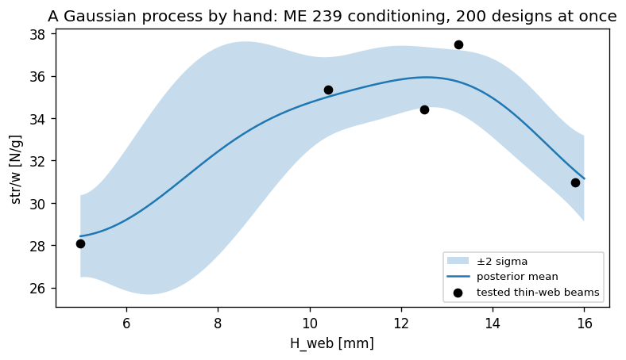
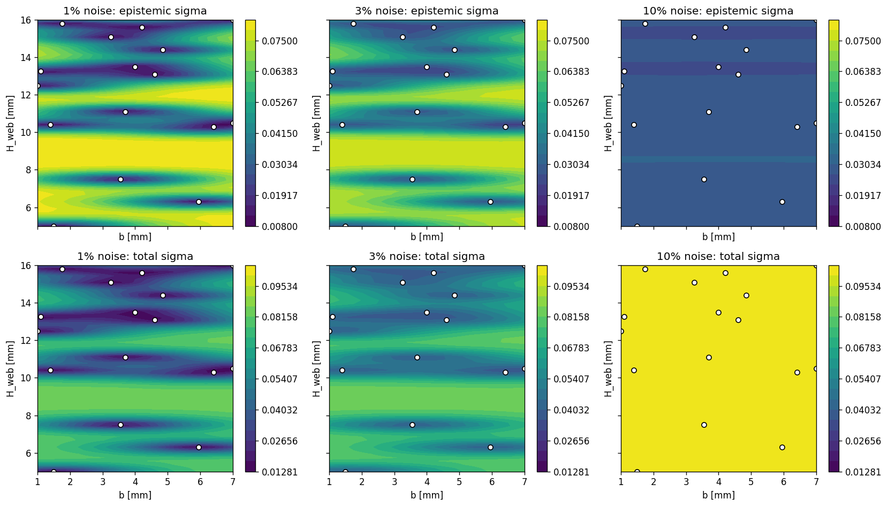
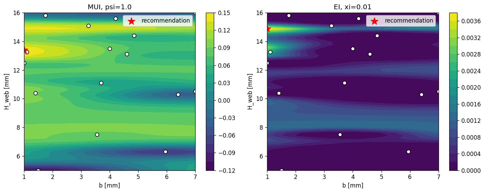
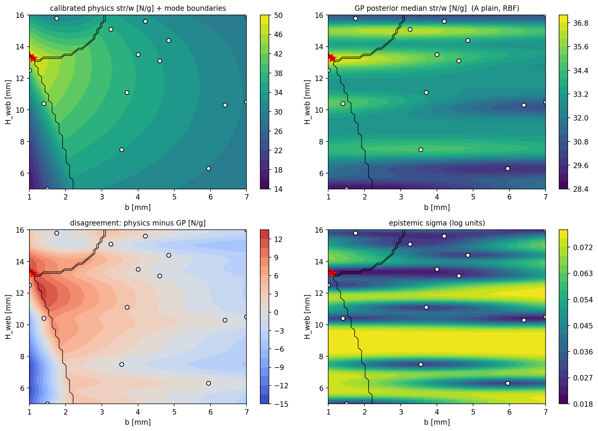

# From Data to Decisions Under Uncertainty
### ME 323 Module 1, Lecture 2

Last time: the equations narrow the beam problem but cannot solve it. A fracture mode with no formula, fixture-dependent LTB, a few expensive tests.

Today: a model that learns from sparse data and tells you how much it does not know.

*(Flow and examples adapted from Prof. Bilionis's data-science lecturebook; notebooks in `Bilionis lecturebook/`.)*

---

## The equations overpredicted a strong beam

- The three calibrated capacity equations selected **b = 1.10 mm, H_web = 13.25 mm** and predicted **48.7 N/g**.
- Ground-truth data from earlier tests gave **475.7 N = 37.48 N/g**, about 23% below the equation prediction.
- All three modeled capacities tie within about 1% there, so the design sits on a mode boundary.

The equations found a strong beam, but overpredicted its performance. Today's tool adds a statement of confidence to the point estimate.

---

## You already have most of this

| Idea | Where you have it |
|---|---|
| Bayes' rule | ME 239 |
| Gaussian distribution | ME 239 |
| Multivariate Gaussian, covariance | ME 239 |
| Conditioning a Gaussian on data | ME 239 |
| **Gaussian Process** | new today, but only one step past 239 |
| **Acquisition functions (BO)** | new today |

We stack the 239 pieces into one tool and point back rather than re-derive.

---

## Bayes, in one line

$$\text{posterior} \propto \text{likelihood}\times\text{prior}$$

You start with a belief about beam strength. You test a beam. You update the belief.

**Prior:** belief before the test. **Likelihood:** compatibility with the result. **Posterior:** belief after the test.

Bayesian thinking carries a **distribution** over unknown beam strength, not a single guess. Every slide that follows applies this line to beams.

---

## A Gaussian is a belief about one beam

These are the four repeat tests used in Pre-lab 2: mean 558.2 N and fitted scatter 7.6 N, or about 1.4%. Pooled campaign repeats give about 4.4% with session/printer structure. The class uses 3% as a working assumption and checks whether that choice changes the recommendation.

---

## Two beams at once: covariance

Nearby designs share material, geometry, and physics, so their strengths move together. The covariance matrix `Σ` writes that down. This is the piece the GP is built on.

---

## Conditioning: measure one, update the other

Measure beam A and the joint Gaussian *conditions*: the belief about beam B shifts and tightens. You did this algebra in 239. Everything today is this move, repeated.

---

## A GP links predictions across many designs

The same joint-Gaussian update can cover 2 designs or 120. A **kernel** fills in the covariances so a test influences nearby designs more than distant ones.

---

## A Gaussian Process, before and after data

Before data, the kernel proposes candidate strength curves. Each test kills the curves that disagree. In this module the GP models log(str/w), so $\exp(\mu_{\log})$ is the **posterior median** in N/g. The band quantifies uncertainty conditional on the model.

---

## Each test reshapes nearby predictions

Current class-campaign data on a thin-web slice. The band narrows near tested beams and stays wide where the model has less support. The equations never gave you that second part.

---

## The kernel is a modeling choice

The length scale answers: how far does one test's influence reach? Too short and every point is an island. Too long and the model cannot bend. There is no single right answer; there are defensible and indefensible ones.

---

## Noise changes both the fit and its uncertainty

Pre-lab 2 refits at 1%, 3%, and 10% using shared color scales so the maps can be compared directly. The 1% fit recommends (1.58, 14.88); the 3% and 10% fits recommend (1.00, 13.39). The recommendation is assumption-sensitive.

---

## Epistemic and aleatory uncertainty do different jobs

- **Epistemic uncertainty:** uncertainty about the underlying average trend because tests are sparse. An informative new beam can reduce it.
- **Aleatory uncertainty:** print-to-print and test-to-test scatter at one nominal design. Testing another location does not remove it.
- For one future observation in log space:

$$\sigma_\text{total}=\sqrt{\sigma_\text{epi}^2+r^2},\qquad r=0.03$$

MUI and EI use $\sigma_\text{epi}$ because they value learnable uncertainty. A reliability bound for one future printed beam uses $\sigma_\text{total}$.

---

## One dial balances performance and uncertainty

**MUI** (maximum upper interval) is an acquisition function:

$$a(x)=\mu(x)+\psi\,\sigma(x)$$

$a(x)$ = score for design $x$; $\mu(x)$ = predicted log(str/w); $\sigma(x)$ = epistemic uncertainty; $\psi$ = how strongly uncertainty affects the choice. At $\psi=0$, MUI selects the highest posterior median.

---

## The loop: Bayesian optimization

Fit → evaluate the acquisition function → choose the design with the highest score → test → refit. The example probes the thin-web corner, learns that region is worse than expected, and settles near the peak.

---

## EI weighs the chance and size of a win

EI asks how much a new test would beat the best tested beam so far, on average. Its $\xi$ setting requires a larger win before improvement counts. Increasing $\xi$ often favors less-certain regions, but does not guarantee a more exploratory recommendation. MUI and EI can recommend different beams because they encode risk appetite differently.

---

## Zoom out: spending a test budget

Each print-and-test costs a machine slot, a test engineer hour, and days of queue. The class gets **two pieces of ground-truth data from earlier tests** through the frozen staff model, and each group gets **one real print**.

Optimal experimental design is the batch version of the acquisition question: given N tests, which set teaches the most or finds the best fastest? Choosing the next test *is* the engineering decision.

---

## Physics-informed GP: the two tracks meet

A vanilla GP sees geometry only. A physics-informed GP can also receive signals computed from the calibrated capacity equations. Those signals may help where the equations capture the governing behavior and may mislead where they omit a mechanism. Submission 1 compares both approaches rather than assuming either one must win.

---

## Decide first; run sensitivity checks afterward

You will meet six modeling "knobs" in Submission 1. Do not treat them as six equal choices.

- **Students decide:** how physics enters the model and the **risk posture** — how predicted performance and uncertainty affect the choice.
- **Students check afterward:** kernel, noise, and target-scale sensitivity.
- If reasonable assumptions move the recommendation, report that instability. If they point to the same neighborhood, report local robustness. An unstable result can justify using a test to reduce uncertainty.

---

## First compare what physics and the GP predict

The top row puts calibrated physics and the GP posterior median on the same design axes. White circles are tested beams; the black lines are physics mode boundaries. Compare the predicted neighborhoods before looking only at one optimum.

---

## Then inspect disagreement and epistemic uncertainty

The bottom row shows where physics and the GP disagree and where epistemic uncertainty remains large. Read a candidate against both maps before committing.

---

## The activity from here

1. **Pre-lab 2**: fit the GP, write MUI (and EI), work the noise assumption, find the GP-recommended beam.
2. **Two class results**: add ground-truth data from earlier tests for the equation design and the GP design — the same two beams for everyone.
3. **Submission 1**: combine physics, GP, and the two new points; pick the beam you will print; defend it in the memo.
4. Print, test, reflect, redesign: Submission 2 folds your own test result back into the model and asks what it changes.

---

## Before next time: Pre-lab 2

In `ME323_Module1_Prelab2_ML`:

- warm up by rebuilding the GP from ME 239's Normal-fit in four small steps (fit one Normal → covariance → conditioning → many beams at once),
- compare vanilla GP setup choices and read posterior median, epistemic uncertainty, and total predictive uncertainty,
- write both MUI and EI,
- refit under 1% / 3% / 10% noise and note what moves,
- record the locked class design: **b = 1.00 mm, H_web = 13.39 mm**, posterior median 36.7 N/g.

That beam is the class's second ground-truth data point from earlier tests. Bring your rationale, not just the number.
