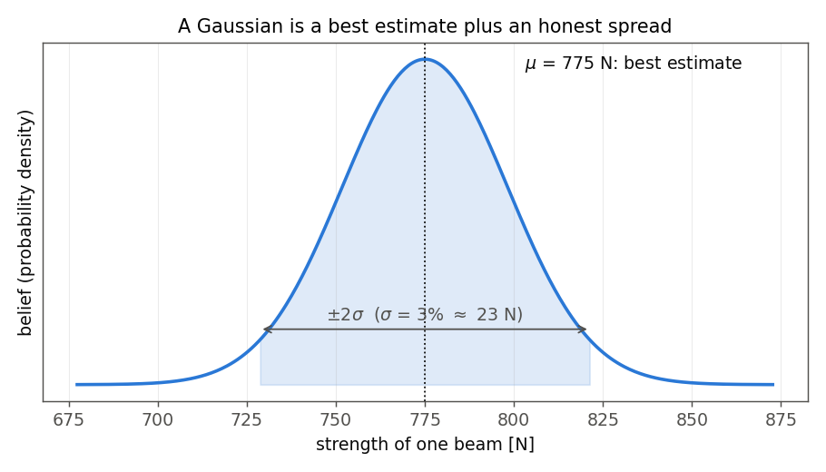
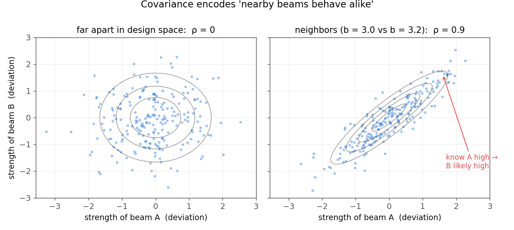
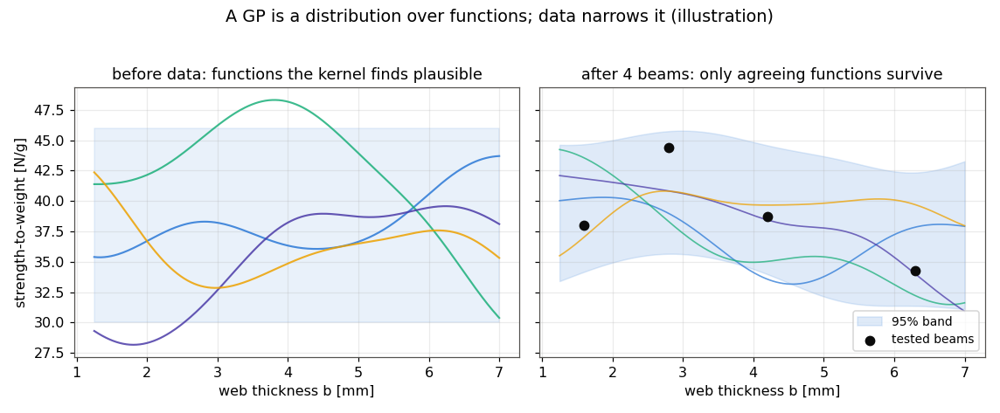
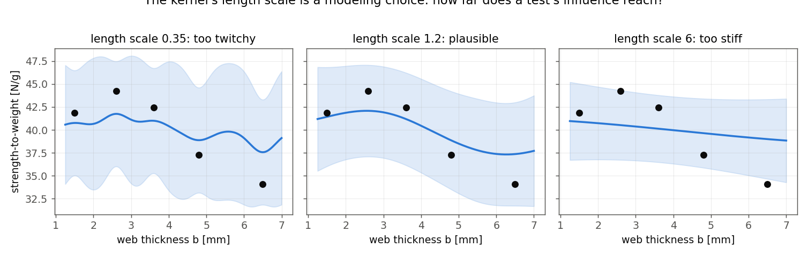
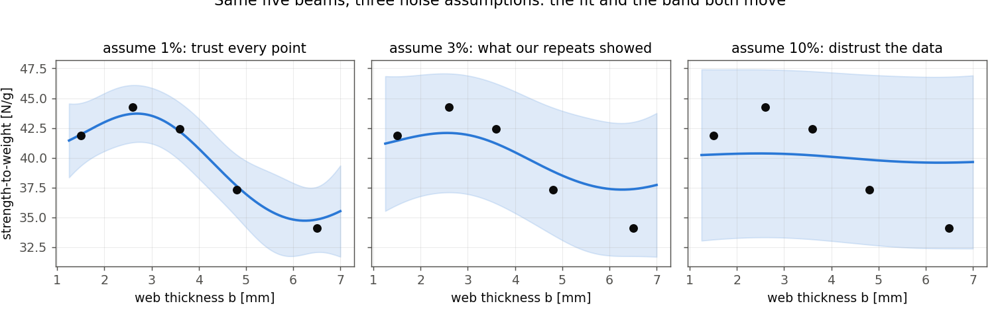
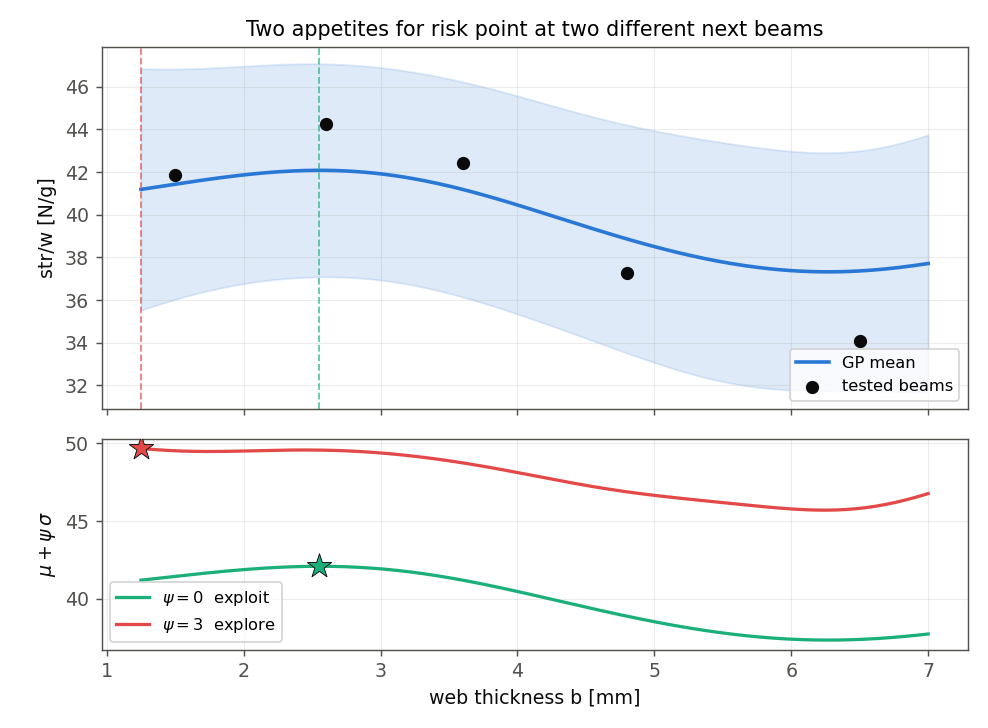

# From Data to Decisions Under Uncertainty
### ME 323 Module 1, Lecture 2

Last time: the equations narrow the beam problem but cannot solve it. A fracture mode with no formula, fixture-dependent LTB, a few expensive tests.

Today: a model that learns from sparse data and tells you how much it does not know.

*(Flow and examples adapted from Prof. Bilionis's data-science lecturebook; notebooks in `Bilionis lecturebook/`.)*

---

## Where Pre-lab 1 left you

- You combined bending and average-web shear into an empirical interaction surrogate, capped it with LTB, and obtained one capacity number per design.
- The parity plot showed where that number holds and where it misses.
- Your optimizer picked **b = 1.25, H_web = 13.4 mm**: predicted 46.6 N/g, measured 483 N = 37.64 N/g, with calibrated dominant-mode proxy LTB.

The physics gave you a *point estimate* in the region you trust it least. The missing ingredient is a statement of confidence. That is today's tool.

---

## You already have most of this

| Idea | Where you have it |
|---|---|
| Bayes' rule | ME 239 |
| Gaussian distribution | ME 239 |
| Multivariate Gaussian, covariance | ME 239 |
| Conditioning a Gaussian on data | ME 239 |
| **Gaussian Process** | new today, but only one step past 239 |
| **Acquisition functions (BO)** | new today |

We stack the 239 pieces into one tool and point back rather than re-derive.

---

## Bayes, in one line

$$\text{posterior} \propto \text{likelihood}\times\text{prior}$$

You start with a belief about beam strength. You test a beam. You update the belief.

Bayesian thinking: carry a **distribution** over the unknown strength surface, not a single guess. Every slide that follows is this line, applied to beams.

---

## A Gaussian is a belief about one beam

Where does the 3% come from? Three repeat prints of one design carried 802, 763, and 775 N. Same geometry, same printer.

---

## Two beams at once: covariance

Nearby designs share material, geometry, and physics, so their strengths move together. The covariance matrix `Σ` writes that down. This is the piece the GP is built on.

---

## Conditioning: measure one, update the other

Measure beam A and the joint Gaussian *conditions*: the belief about beam B shifts and tightens. You did this algebra in 239. Everything today is this move, repeated.

---

## The leap: a function is a long Gaussian vector

Strength at 2 designs: a 2D Gaussian. At 120 designs: a 120-dimensional Gaussian. Connect the dots and the vector *is* a function. A **kernel** fills in the covariances: nearby beams correlate, distant ones do not.

---

## A Gaussian Process, before and after data

Before data, the kernel proposes candidate strength curves. Each test kills the curves that disagree. In this module the GP models log(str/w), so $\exp(\mu_{\log})$ is the **posterior median** in N/g. The band quantifies uncertainty conditional on the model.

---

## Watch it learn, one beam at a time

*(Earlier beam campaign, span-200 geometry; the concept is what matters. This animation gets rebuilt from the new 44-beam dataset when testing finishes.)*

The band collapses where beams land and stays wide where nothing has been tested. The equations never gave you that second part.

---

## The kernel is a modeling choice

The length scale answers: how far does one test's influence reach? Too short and every point is an island. Too long and the model cannot bend. There is no single right answer; there are defensible and indefensible ones.

---

## So is the noise

We assume 3% from repeat prints (802, 763, 775 N). Pre-lab 2 refits at 1%, 3%, and 10% as a sensitivity check. The recommendation moves to (1.64, 14.88) at 1%; the 3% and 10% choices remain near (1.44, 13.4). Local stability does not prove the noise assumption correct.

---

## Epistemic and aleatory uncertainty do different jobs

- **Epistemic uncertainty** is uncertainty about the latent response surface because tests are sparse. Informative new beams can reduce it.
- **Aleatory uncertainty** is print-to-print and test-to-test scatter at a fixed nominal design. Another location does not remove it.
- For one future observation in log space:

$$\sigma_\text{total}=\sqrt{\sigma_\text{epi}^2+r^2},\qquad r=0.03$$

MUI and EI use $\sigma_\text{epi}$ because they value learnable uncertainty. A reliability bound for one future printed beam uses $\sigma_\text{total}$.

---

## Explore vs exploit

Exploit: test where the posterior median is highest. Explore: test where epistemic uncertainty is widest. **MUI** makes the tradeoff a dial in latent log space:

$$a(x)=\mu(x)+\psi\,\sigma(x)$$

---

## The loop: Bayesian optimization

Fit → pick the acquisition argmax → test → refit. Watch it probe the thin-web corner once, learn the surface is worse than it looks there, and settle on the real peak. Seven tests, no gradient, no formula for the dip.

---

## Expected Improvement, the other dial

**EI** asks: by how much would a new test *beat the best beam so far*, on average?

- accounts for both latent mean $\mu$ and epistemic uncertainty $\sigma$, like MUI,
- but weighs *improvement*, so it stops caring about regions that cannot win.

MUI and EI can point at different next beams. The choice encodes your appetite for risk; Pre-lab 2 has you code both.

---

## Zoom out: spending a test budget

Each print-and-test costs a machine slot, a technician hour, and days of queue. You will get **two** synthetic queries and **one** real print.

Optimal experimental design is the batch version of the acquisition question: given N tests, which set teaches the most or finds the best fastest? Choosing the next test *is* the engineering decision.

---

## Physics-informed GP: the two tracks meet

*(Earlier campaign data; rebuilt with the new dataset when testing finishes.)*

The plain GP sees only `(b, H_web)`. Submission 1 lane C also sees `log(P_phys)` and `P_LTB/P_bend`, where `P_phys` is the calibrated empirical capacity. The features sharpen the fit where their physics is useful and can mislead where beams fracture along layers. Deciding which region you are in is your job, not the model's.

---

## The activity from here

1. **Pre-lab 2**: fit the GP, write MUI (and EI), work the noise assumption, find the GP-recommended beam.
2. **Two queries**: test your equation design and your GP design against the ground-truth model. Only two.
3. **Submission 1**: combine physics, GP, and the two new points; pick the beam you will print; defend it in the memo.
4. Print, test, reflect, redesign.

---

## Before next time: Pre-lab 2

In `ME323_Module1_Prelab2_ML`:

- compare vanilla GP setup choices and read posterior median, epistemic uncertainty, and total predictive uncertainty,
- write both MUI and EI,
- refit under 1% / 3% / 10% noise and note what moves,
- record the locked class design: **b = 1.44 mm, H_web = 13.39 mm**, posterior median 36.8 N/g.

That beam is your second ground-truth query. Bring your rationale, not just the number.
